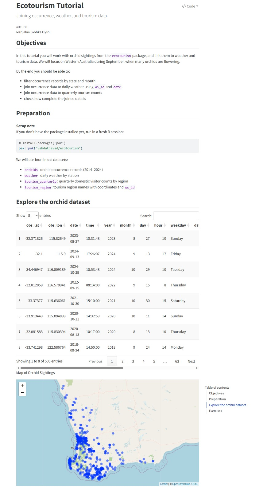
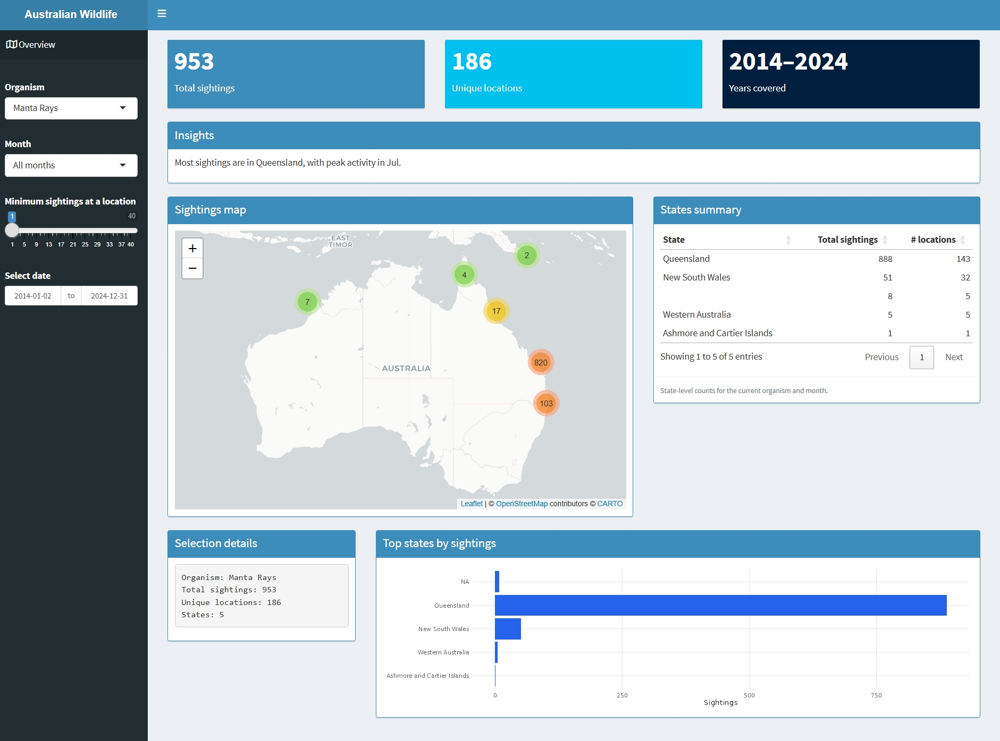
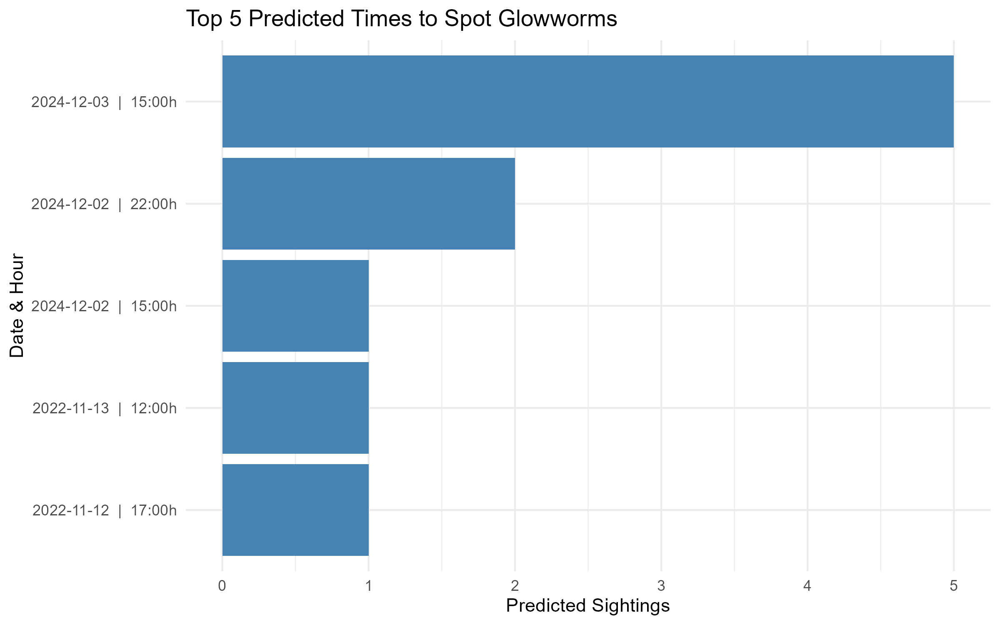

# Ecotourism GSoC Technical Tasks

This repository contains my solutions for the **Ecotourism** project technical tests.
The project focuses on linking species occurrence records with environmental data to provide insights for sustainable tourism and conservation.

## 🚀 Project Overview

I have completed three core tasks demonstrating proficiency in R, data engineering, statistical modeling, and interactive web development.

------------------------------------------------------------------------

### 1. Easy Task: Ecotourism Tutorial

**Objective:** demonstrate data joining and cleaning using `tidyverse`.
\* **Key Skills:** Data wrangling, joining spatial/temporal datasets, and Quarto documentation.
\* **Live Link:** [View Interactive Tutorial](https://mahjabinoyshi.github.io/ecotourism-gsoc-tests/ecotourism_tutorial.html)

------------------------------------------------------------------------

### 2. Medium Task: Australian Wildlife Dashboard

**Objective:** Build an interactive Shiny application for real-time data exploration.
\* **Key Skills:** `shiny`, `leaflet` for mapping, `bslib` for UI design, and reactive programming.
\* **Live Link:** [Launch Shiny Dashboard](https://mahjabinoyshi.shinyapps.io/ecotourism-medium-task-oyshi/)

------------------------------------------------------------------------

### 3. Hard Task: Predictive Modeling for Species Sightings

**Objective:** Use historical patterns to estimate the best times for wildlife spotting.
\* **Methodology:** Implemented a **Poisson Generalized Linear Model (GLM)** to analyze how temperature, humidity (dew point), and time of day influence Gouldian Finch sightings.
\* **Insights:** Identified that humidity and seasonal timing are stronger predictors for sightings than immediate rainfall or wind speed.
\* **Live Link:** [View Modeling Analysis](https://mahjabinoyshi.github.io/ecotourism-gsoc-tests/Hard%20Test.html)

------------------------------------------------------------------------

## 🛠️ Technical Stack

-   **Language:** R (v4.4.3)
-   **Modeling:** Poisson Regression (GLM)
-   **Visualization:** `ggplot2`, `leaflet`, `plotly`
-   **Deployment:** GitHub Pages & ShinyApps.io
-   **Reproducibility:** Managed via `renv`

## 📜 Certifications

-   **DataCamp:** Building Web Applications with Shiny in R\
    [View Certificate PDF](./DataCamp%20Certification%20on%20Shiny/Building%20Web%20Applications%20with%20Shiny%20in%20R/DataCamp_Shiny_Certificate.pdf)

------------------------------------------------------------------------

**Author:** Mahjabin Siddika Oyshi
